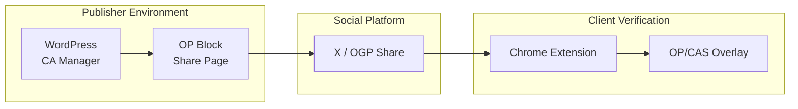
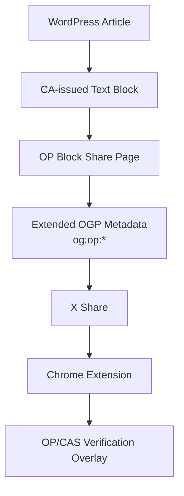

🇯🇵For Japanese readers:
[Jump to Japanese version](#japanese)

# OPG CA Extension

This Chrome extension displays OP/CAS authentication information on sender profile-enabled websites and social networking platforms like X.

This extension is an experimental implementation exploring how
OP/CAS authenticity metadata can coexist with existing
OGP-based social sharing ecosystems such as X (Twitter).

The extension supports OP Block Share pages,
extended OGP metadata (`og:op:*`),
and OP/CAS verification overlays generated by the
WordPress CA Manager Extension.

## Implementation image of OP compatible web page
Clicking on a CA-issued block will copy the text and OP information of the target block.

<table>
<tr>
<td>


</td>
</tr>
</table>
<br/><br/>

## X (Twitter) OP Block Share Example

The following screenshot shows:

- X shared article block
- OGP-based OP Block Share page
- OP/CAS verification overlay
- Extended OGP metadata integration

<table>
<tr>
<td>


</td>
</tr>
</table>
<br/><br/>

## The screen that appears when you click a link in a tweet on X

<table>
<tr>
<td>


</td>
</tr>
</table>


---

## Features

* Detect OP/CAS metadata from web pages
* Display OP verification popup overlay
* Support OP Block Share pages
* Support extended OGP metadata (`og:op:*`)
* Support X (Twitter) article block sharing
* Display article author / issuer information
* Support CAS verification visualization

---

## Architecture



---
## OP Block Share Flow



## Example OP Block Share URL

The WordPress CA Manager Extension automatically generates
OP Block Share page URLs such as:

<pre>https://style.yh-inc.jp/op-share/{hash}/</pre>

## Extended OGP Metadata Example

```html
<meta property="og:title" content="Article Title">
<meta property="og:type" content="article">

<meta property="og:op:issuer" content="dns:style.yh-inc.jp">
<meta property="og:op:author" content="Yoshifumi Takeuchi">
<meta property="og:op:cas" content="https://example.com/cas/{id}">
```

---

## Related Project

* [WordPress CA Manager Extension](https://github.com/yoshid8s/ca-manager-extension)
* [OP Block Share](https://github.com/yoshid8s/opg-ca-extension/releases/tag/v0.2.0-op-share)
* [Extended OGP metadata ( og:op:* )](https://github.com/yoshid8s/opg-ca-extension/blob/main/docs/extended-ogp.md)
* [Originator Profile](https://docs.originator-profile.org/ja/)
* [Content Attestation](https://github.com/originator-profile/docs.originator-profile.org/blob/main/docs/opb/ca.md)
* [CA Playground](https://playground.originator-profile.org/#description/server-api-endpoint-list)

---

## Installation

1. Download this repository
2. Open Chrome Extensions
3. Enable Developer Mode
4. Click "Load unpacked"
5. Select this directory

---

## Notes

This project is an experimental implementation intended to explore:
* OP/CAS metadata overlays
* OGP-compatible authenticity metadata
* Block-level article sharing
* OP verification UX for social sharing ecosystems

<a id="japanese"></a>

# Japanese Version

# OPG CA 機能拡張

発信者プロファイル対応ウェブサイトやXなどのSNSプラットフォームでOP/CAS認証情報を表示するChrome拡張機能です。

この拡張機能は、OP/CAS認証メタデータがX（Twitter）などの既存のOGPベースのソーシャルシェアリングエコシステムとどのように共存できるかを検証する実験的な実装です。

この拡張機能は、OPブロックシェアページ、拡張OGPメタデータ（`og:op:*`）、およびWordPress CA Manager拡張機能によって生成されるOP/CAS認証オーバーレイをサポートしています。

## OP対応Webページでの実装イメージ
CA発行されたブロックをクリックすると、対象ブロックのテキストとOP情報がコピーされる

<table>
<tr>
<td>
  


</td>
</tr>
</table>
<br/><br/>

## X（Twitter）OPブロックシェア例

以下のスクリーンショットは、以下の内容を示しています。

- Xで共有した記事ブロック
- OGPベースのOPブロック共有ページ
- OP/CAS検証オーバーレイ
- 拡張OGPメタデータ統合

<table>
<tr>
<td>


</td>
</tr>
</table>
<br/><br/>

## Xでのツィートのリンクをクリックすると表示される画面

<table>
<tr>
<td>


</td>
</tr>
</table>

---

## 特徴

* Web ページから OP/CAS メタデータを検出
* OP検証ポップアップオーバーレイを表示
* OP ブロック共有ページをサポート
* 拡張 OGP メタデータ (`og:op:*`) をサポート
* X (Twitter) 記事ブロック共有をサポート
* 記事の著者/発行者情報を表示します
* CAS検証の視覚化をサポート

---

## アーキテクチャ


---

## OP Block Share Flow


## OP Block シェア URLの例

WordPress CA Manager Extension により、
以下のような OP Block Share URL が自動生成されます。

<pre>https://style.yh-inc.jp/op-share/{hash}/</pre>

## 拡張 OGP メタデータの例

```html
<meta property="og:title" content="記事タイトル">
<meta property="og:type" content="article">

<meta property="og:op:issuer" content="dns:style.yh-inc.jp">
<meta property="og:op:author" content="竹内好文">
<meta property="og:op:cas" content="https://example.com/cas/{id}">
```

---

## 関連プロジェクト

* [WordPress CA Manager Extension](https://github.com/yoshid8s/ca-manager-extension)
* [OP Block Share](https://github.com/yoshid8s/opg-ca-extension/releases/tag/v0.2.0-op-share)
* [Extended OGP metadata ( og:op:* )](https://github.com/yoshid8s/opg-ca-extension/blob/main/docs/extended-ogp.md)
* [Originator Profile](https://docs.originator-profile.org/ja/)
* [Content Attestation](https://github.com/originator-profile/docs.originator-profile.org/blob/main/docs/opb/ca.md)
* [CA Playground](https://playground.originator-profile.org/#description/server-api-endpoint-list)

---

## インストール

1. このリポジトリをダウンロードします
2.Chrome拡張機能を開きます
3. 開発者モードを有効にする
4.「解凍してロード」をクリックします。
5. このディレクトリを選択します

---

## 注意事項

このプロジェクトは、次のことを探ることを目的とした実験的な実装です。

* OP/CAS メタデータ オーバーレイ
* OGP 互換の信頼性メタデータ
* ブロックレベルの記事共有
* ソーシャルシェアリングエコシステムのOP検証UX

